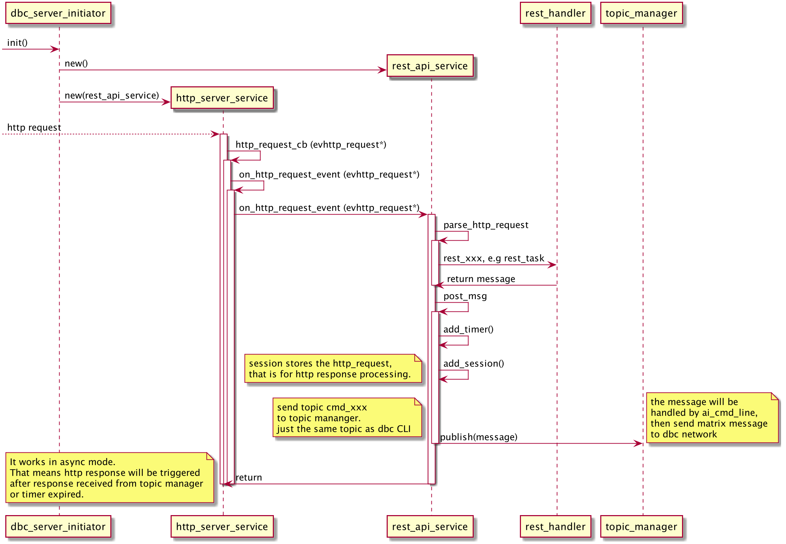
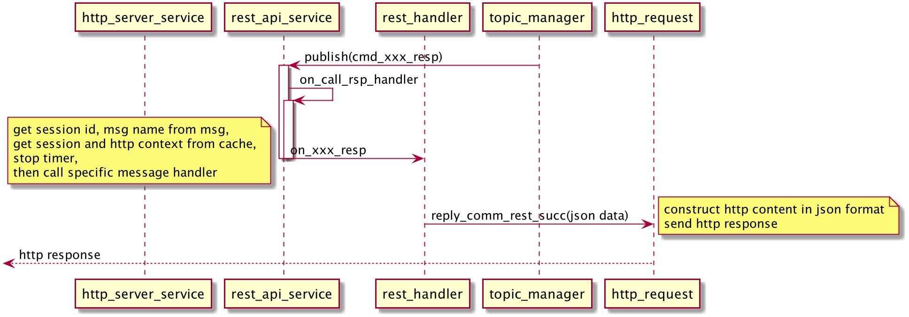

This document depicts the basic design concept of DBC RESTFul API
* dbc uses libevent to implemnt the http server
* dbc uses rapidjason to do json encode/decode  


<div style="text-align:center", align=center>
<br/>


....

<div style="text-align:center", align=center>
<br/>


# DBC RESTFUL API   (V1.0)

DBC RESTFUL API 是DBC网络节点提供的HTTP API，大多数DBC客户端的命令直接映射到本API服务端口。
 
 
DBC进程默认在端口41107监听，以提供Http API服务，同时
可以自定义core.conf文件的http_ip与http_port,来改变默认的端口。


```
 core.conf
 
 
 ...
 rest_ip=127.0.0.1
 rest_port=41107
 ...
```

测试服务器： 
http://10.10.254.100:41107/api/v1/xxxxxx

例如： http://10.10.254.100:41107/api/v1/peers/global

# 响应的主体
 
API使用标准HTTP状态代码来指示API调用的成功或失败。响应的主体将采用以下格式的JSON：


```
req->WriteHeader("Content-Type", "application/json");
req->WriteReply(http_status, response_message + "\r\n");


{
  "error_code":error_code,//约定0表示无错误，此时error_message可忽略；
                          //否则error_message描述错误的原因
  "error_message": "xxxxxxxxxxx",
                            
  "data":{ //data字段是一个对象，表示响应的实体。在error_code非0时，可能为空。
      
  }
}
```

注意：可能遇到节点刚刚启动就接收到客户端请求的情况，为了确保节点顺利点接入dbc网络，这里限定dbc节点启动后5s之内拒绝服务；

请求应该在5s后重试。

```

{
  "error_code": -32602,
  "error_message": "Request is interrupted.Try again later."
}

```
 
# 版本
本文档描述的API版本，约定为v1.0 。


API通常在每个版本中都会更改，因此API调用会进行版本控制以确保客户端不会中断。要锁定到特定版本的API，请在URL前加上其版本，例如，调用/api/v1.0/info以使用/info端点的v1.0版本。如果守护程序不支持URL中指定的API版本，400 Bad Request则会返回HTTP 错误消息。

```
GET /api/v1/

可以查看当前api的具体的版本信息，用以跟踪当前版本的api的每一次升级。


{
  "error_code": 0,
  "data": {
    "version": "v1.0.0.1"
  }
}

```


# 业务接口定义

### (1) 获取指定挖矿节点的硬件信息

```
GET /api/v1/mining_nodes/{nodeid}

这个接口等价于命令 show -n {nodeid}的功能 
```

[Query Parameters]

```
无
```
[Response Samples]

```
GET /api/v1/mining_nodes/2gfpp3MAB3w5vHsvd7uNhz7zKy3WYgwf2Ezj1ddWoky
{
    "error_code": 0,
    "data": {
        "cpu": {
            "num": "32",
            "type": "Intel(R) Xeon(R) Silver 4110 CPU"
        },
        "cpu_usage": "0%",
        "disk": {
            "size": "3.4T",
            "type": "SSD",
            "speed": "981 MB/s"
        },
        "gpu": {
            "num": "4",
            "driver": "410.66",
            "cuda": "10.0",
            "p2p": "ok",
            "gpus": [
                {
                    "id": "0",
                    "type": "GeForceGTX1080Ti",
                    "mem": "11178 MiB",
                    "bandwidth": "12042.7 MB/s"
                },
                {
                    "id": "1",
                    "type": "GeForceGTX1080Ti",
                    "mem": "11178 MiB",
                    "bandwidth": "6036.3 MB/s"
                }
            ]
        },
        "gpu_state": {
            "gpus": [
                {
                    "id": "0",
                    "state": "idle"
                },
                {
                    "id": "1",
                    "state": "idle"
                }
            ]
        },
        "gpu_usage": [
            {
                "gpu": "0 %",
                "mem": "0 %"
            },
            {
                "gpu": "0 %",
                "mem": "0 %"
            }
        ],
        "images": [
            "dbctraining/cuda9.0-mining-gpu:v1.0.6",
            "dbctraining/cuda9.0-mining-gpu:v1",
            "dbctraining/tensorflow1.9.0-cuda9-gpu-py3:v1.0.0",
            "dbctraining/tensorflow1.3-gpu-cuda8-py2:v0.3.0",
            "dbctraining/pytorch0.4.1-gpu-cuda9-cudnn7-py3:v1.0.0",
            "dbctraining/h2o-gpu-cuda9-py3:v1.0.0",
            "dbctraining/h2o-cpu-py2:v1.0.0",
            "dbctraining/mxnet1.2.1-gpu-cuda9-py2:v1.0.0",
            "dbctraining/cntk2.5-gpu-cuda9-py3:v1.0.1",
            "dbctraining/caffe1-gpu-cuda8-py2:v1.0.0"
        ],
        "ip": "111.44.254.133",
        "mem": "125G",
        "mem_usage": "2.87355%",
        "network_dl": "286.66 Mbit/s",
        "network_ul": "325.60 Mbit/s",
        "os": "Ubuntu 16.04.4 LTS 4.13.0-36-generic GNU/Linux",
        "state": "idle",
        "version": "0.3.6.6"
    }
}

```

###  (2)获取挖矿节点的列表

```
GET /api/v1/mining_nodes

这个接口等价于命令 show -s的功能 
```

[Query Parameters]

```
无
```
[Response Samples]

```
GET /api/v1/mining_nodes

{
  "error_code": 0,
  "data": {
    "mining_nodes": [
     
      {
        "service_list": "ai_training",
        "nodeid": "2gfpp3MAB44qzxamtsLkYCJ98xjM1i9hDenjNQzPfcb",
        "name": "10.255.0.194",
        "time_stamp": "N/A",
        "gpu": "1 * TeslaP40",
        "ver": "0.3.4.1",
        "gpu_usage": "N/A",
        "state": "idle"
      },
      {
        "service_list": "ai_training",
        "nodeid": "2gfpp3MAB41WgLXHDagBPsSidYywPk6nctHF3kWWfbZ",
        "name": "10.255.0.206",
        "time_stamp": "N/A",
        "gpu": "1 * TeslaP40",
        "ver": "0.3.4.1",
        "gpu_usage": "N/A",
        "state": "idle"
      },
 
       
      {
        "service_list": "ai_training",
        "nodeid": "2gfpp3MAB41LW6RuCkkdbDtDZqVYNVwrBdMarEyoj6B",
        "name": "qwe-SYS-7048GR-T",
        "time_stamp": "N/A",
        "gpu": "2 * GeForceRTX2080 6 * Unknown",
        "ver": "0.3.4.1",
        "gpu_usage": "N/A",
        "state": "idle"
      }
    ]
  }
}

```
### (3)获取本节点上收集的peers

```
GET /api/v1/peers/{option}

这个接口等价于命令 peers -a/g的功能。
其中{option}的取值：
active表示获取本节点正在连接着的peers；
global表示获取本节点记录作为备选的邻接点。
```

[Query Parameters]

```
无
```
[Response Samples]


```

GET  /api/v1/peers/global


{
  "error_code": 0,
  "data": {
    "peer_nodes_list": [
      {
        "peer_node_id": "2gfpp3MAB3viVwDaTH57JXAVLmKqrNM6PghtHCmEzR8",
        "live_time_stamp": 0,
        "net_st": "in_use",
        "ip": "*.*.21.175",
        "port": 21107,
        "node_type": "nnt_normal_node",
        "service_list": [
          "ai_training"
        ]
      },
  
 
      {
        "peer_node_id": "2gfpp3MAB433gEDzVpxDTiNLQtAq6YE8LogzMj4d9v2",
        "live_time_stamp": 0,
        "net_st": "available",
        "ip": "*.*.19.45",
        "port": 21107,
        "node_type": "nnt_normal_node",
        "service_list": [
          "ai_training"
        ]
      }
    ]
  }
}
```


### (4)获取本节点上提交的任务

```
GET /api/v1/tasks/{task_id}

{task_id} 字段作为可选项,
如果task_id为空，即/api/v1/tasks 等价于task -a,表示查询出所有的任务;
如果task_id不为空，例如 /api/v1/tasks/123等价于 task -t 123，表示筛选出特定的任务。
```

 
[Query Parameters]

```
无
```
[Response Samples]


```
GET /api/v1/tasks


{
  "error_code": 0,
  "data": {
    "task_status_list": [
      {
        "task_id": "kvkdCCjkdsLqPf6JLfjupPaL3hJTrZJomS8VbKWEC59125AXS",
        "create_time": 1542802238,
        "status": "task_stopped"
      },
      {
        "task_id": "MfZABmuHvZxVXRs9A8G9GeU7SnxPbkE1E7DJtQ8e3YDXLyz6Q",
        "create_time": 1542786204,
        "status": "task_overdue_closed"
      },
      {
        "task_id": "2B1SnsnZnm8f4TYtydUxuf7gQV3PaW6sNLmwjzd8Ug7gyR2Lav",
        "create_time": 1542785873,
        "status": "task_overdue_closed"
      },
      {
        "task_id": "2cDFtsdn7GyZMQDkgSGcraPcprxryuZenxHuhWLDahLhXqxgwG",
        "create_time": 1542785738,
        "status": "task_overdue_closed"
      }
    ]
  }
}

GET /api/v1/tasks/kvkdCCjkdsLqPf6JLfjupPaL3hJTrZJomS8VbKWEC59125AXS


{
  "error_code": 0,
  "data": {
    "task_id": "kvkdCCjkdsLqPf6JLfjupPaL3hJTrZJomS8VbKWEC59125AXS",
    "create_time": 1542802238,
    "status": "task_stopped"
  }
}


```


### (5)手动停止本节点上正在运行的一个任务

```
POST /api/v1/tasks/<task_id>/stop

这个接口等价于命令 stop -t <task_id>的功能,
支持POST/GET，发出请求后将终止task_id的任务
```

[Query Parameters]

```
无
```
[Response Samples]
 
```
POST /api/v1/tasks/fpWczv5NEsHLTu7CMhweT1G5bD2LaMCcWzGFDmKjAZUrTu1rX/stop

{
  "error_code": 0,
  "data": {
    
  }
}

```

### (6)在本节点上发起一个任务

```
POST /api/v1/tasks/start

这个接口等价于命令 start -c <config_file>的功能,
支持POST，发出请求后将终止task_id的任务。
```

[Query Parameters]

```
{
	"code_dir": "QmW7xeDshhbJFMiQ1WgtnimUJTd3j3JdfyQdtbdoz9mS6n",
	"entry_file": "run.sh",
	"training_engine": "dbctraining/tensorflow1.9.0-cuda9-gpu-py3:v1.0.0"",
	"description": "This is a GPU Server with 1 GPU card",
     "peer_nodes_list": ["2gfpp3MAB4ARp8JAkTBjPyEUdPM2wckxuDgHNQ3AxKA"], 
     "server_specification": {"env":{"NVIDIA_VISIBLE_DEVICES":"0"},"ip": "192.168.1.113","port": {"22":"1022"}}}'
}

注意：这里的请求参数，其实就是任务的配置文件所描述的配置项目。
```
[Response Samples]
 
```


POST /api/v1/tasks/start

{
    "error_code": 0,
    "data": {
        "task_id": "2tmx3oUWuQ6eT5KBETTDLurJzrvNbnTAzsGnzCgayZqxpz5qqt",
        "create_time": 1542804436,
        "status": "task_unknown"
    }
}

Note:发起任务时，请确保training_engine所指的镜像一定在nodeid指定的节点上，服务端会在验证镜像与节点的有效性。

搜索一个无效的节点，会引发请求超时，因为等待了很久都没有在整个网络里找到该节点。

```

```
def api_task_start():
    uri="/api/v1/tasks/start"

    data={
        "data_dir": "",
        "hyper_parameters": "eth:0x78bcc8019åe002ac7f8e16774",
        "entry_file": "mine_rvn.sh",
        "select_mode": 0,
        "code_dir": "QmPnA19wDpduarozevhWE6nWbPyVHCceWyhTKmezQcRxM6",
        "training_engine": "dbctraining/cuda9.0-mining-gpu:v1.0.2",
        "master": "",
        "peer_nodes_list": ["2gfpp3MAB43ZWH5fcLDepW4z1XSE2ro3Yan6Yv6WeDQ"],
        "checkpoint_dir": "/ipfs/XLYkgq61DYaQ8NhkcqyU7rLcnSa7dSHQ16x/data/output",
        "server_count": 0,
        "server_specification": " "
    }

    post_json(uri,data)
```

### (7)获取本节点特定任务的运行日志

```
GET /api/v1/tasks/{task_id}/trace?flag=tail&line_num=100

这个接口等价于命令 logs -t <task_id>的功能;


```

[Query Parameters]


```
?flag=tail&line_num=100

其中：
flag=tail 表示从尾部读取日志；
flag=head 表示从头部读取日志；
line_num=100 表示读取日志的行数，本查询请求限制一次可读取最大的行数为100


```

[Response Samples]

```
GET /api/v1/tasks/2b6snbnYjNk4Cy5x97QSGK9N4cHFuKdkH6ZyBqmD533fzkGPzs/trace?flag=tail&line_num=100


{
  "error_code": 0,
  "data": {
    "peer_node_logs": [
      {
        "peer_node_id": "2gfpp3MAB43ZWH5fcLDepW4z1XSE2ro3Yan6Yv6WeDQ",
        "log_content": "2018-11-21T12:47:52.488047895Z ........."
        }
     ]
  }
        
}
```


### (8)获取本节点特定任务的运行结果

```
GET /api/v1/tasks/<task_id>/result

这个接口等价于命令 result -t <task_id>的功能；

```

[Query Parameters]


```
无
```


[Response Samples]


```
GET /api/v1/tasks/fpWczv5NEsHLTu7CMhweT1G5bD2LaMCcWzGFDmKjAZUrTu1rX/result


{
  "error_code": 0,
  "data": {
    "training_result_file": "QmUWbGiwFSi2RKBeKR68aWyoxCjXN35RVRt6trqesnXFGw"
  }
}
```


### (9)查看节点特定任务的快照列表或某个快照的详细信息

```
GET /api/v1/snapshot/<task_id>/{snapshot_name}

{snapshot_name} 字段作为可选项,
如果snapshot_name为空，即/api/v1/snapshot/<task_id> 等价于snapshot -a -t task_id,表示查询出特定任务的快照列表;
如果snapshot_name不为空，例如 /api/v1/snapshot/<task_id>/snap_name 等价于 snapshot -s snap_name -t task_id，表示筛选出特定任务的特定快照的详细信息。
```

[Query Parameters]


```
无
```


[Response Samples]


```
GET /api/v1/snapshot/fpWczv5NEsHLTu7CMhweT1G5bD2LaMCcWzGFDmKjAZUrTu1rX


{
  "error_code": 0,
  "data": [
    {
      "snapshot_name": "snap1",
      "description": "my desc",
      "create_time": "2021-12-10 14:00:00",
      "state": "disk-snapshot"
    },
    {
      "snapshot_name": "snap2",
      "description": "my desc 2",
      "create_time": "2021-12-11 14:00:00",
      "state": "disk-snapshot"
    }
  ]
}
```


### (10)给节点的特定任务创建快照

```
GET /api/v1/snapshot/<task_id>/create

task_id表示需要创建快照的任务。
需要在请求的additional里面写明需要创建的快照的name, description, disks等信息。
```

[Query Parameters]


```
无
```


[Response Samples]


```
GET /api/v1/snapshot/fpWczv5NEsHLTu7CMhweT1G5bD2LaMCcWzGFDmKjAZUrTu1rX/create


{
  "error_code": 0,
  "data": {
    "snapshot_name": "snap1",
    "description": "my desc",
    "state": "creating"
  }
}
```

# 错误码

 


```
enum RPCErrorCode
{
    //没有任何错误发生
    
    RPC_RESPONSE_SUCCESS=0,
    
    //发生请求被处理前的错误码
    
    RPC_INVALID_REQUEST = -32600,//The inspection request is illegal.
    RPC_METHOD_NOT_FOUND = -32601,//Check that the requested method does not exist
    RPC_REQUEST_INTERRUPTED= -32602,//Request is interrupted.Try again later.


    //等待响应过程中出现的错误码

    RPC_RESPONSE_TIMEOUT=-32700, //call timeout
    RPC_RESPONSE_ERROR = -32701,// response error
    
    
    //发生在请求被处理时的具体错误项目
    //响应错误若可指定具体错误项目，则用以下错误码；否则直接使用RPC_RESPONSE_ERROR
    RPC_MISC_ERROR = -1,  //!< std::exception thrown in command handling
    RPC_TYPE_ERROR = -3,  //!< Unexpected type was passed as parameter
    RPC_INVALID_ADDRESS_OR_KEY = -5,  //!< Invalid address or key
    RPC_OUT_OF_MEMORY = -7,  //!< Ran out of memory during operation
    RPC_DATABASE_ERROR = -9, //!< Database error
    RPC_DESERIALIZATION_ERROR = -11, //!< Error parsing or validating structure in raw format
    RPC_VERIFY_ERROR = -13, //!< General error during transaction or block submission
    RPC_VERIFY_REJECTED = -15, //!< Transaction or block was rejected by network rules
    RPC_VERIFY_ALREADY_IN_CHAIN = -17, //!< Transaction already in chain
    RPC_IN_WARMUP = -19, //!< Client still warming up
    RPC_SYSTEM_BUSYING=-21,//!<Work queue depth exceeded
    RPC_METHOD_DEPRECATED = -23, //!< RPC method is deprecated
    RPC_INVALID_PARAMS = -25, //!<
  
};
 
```

 


# 状态码
```
#define HTTP_OK			200	/**< request completed ok */
#define HTTP_NOCONTENT		204	/**< request does not have content */
#define HTTP_MOVEPERM		301	/**< the uri moved permanently */
#define HTTP_MOVETEMP		302	/**< the uri moved temporarily */
#define HTTP_NOTMODIFIED	304	/**< page was not modified from last */
#define HTTP_BADREQUEST		400	/**< invalid http request was made */
#define HTTP_NOTFOUND		404	/**< could not find content for uri */
#define HTTP_BADMETHOD		405 	/**< method not allowed for this uri */
#define HTTP_ENTITYTOOLARGE	413	/**<  */
#define HTTP_EXPECTATIONFAILED	417	/**< we can't handle this expectation */
#define HTTP_INTERNAL           500     /**< internal error */
#define HTTP_NOTIMPLEMENTED     501     /**< not implemented */
#define HTTP_SERVUNAVAIL	503	/**< the server is not available */
```


For example

```
# curl -X POST -H "Content-Type: application/json" http://127.0.0.1:41107/api/v1/tasks/start -d 
 '{ "training_engine": "dbctraining/tensorflow1.9.0-cuda9-gpu-py3:v1.0.0", 
 "code_dir": "QmW7xeDshhbJFMiQ1WgtnimUJTd3j3JdfyQdtbdoz9mS6n", 
 "peer_nodes_list": ["2gfpp3MAB4ARp8JAkTBjPyEUdPM2wckxuDgHNQ3AxKA"], 
 "entry_file":"run.sh",
 "server_specification": {"env":{"NVIDIA_VISIBLE_DEVICES":"0"},"ip": "192.168.1.113","port": {"22":"1022"}}}'
```